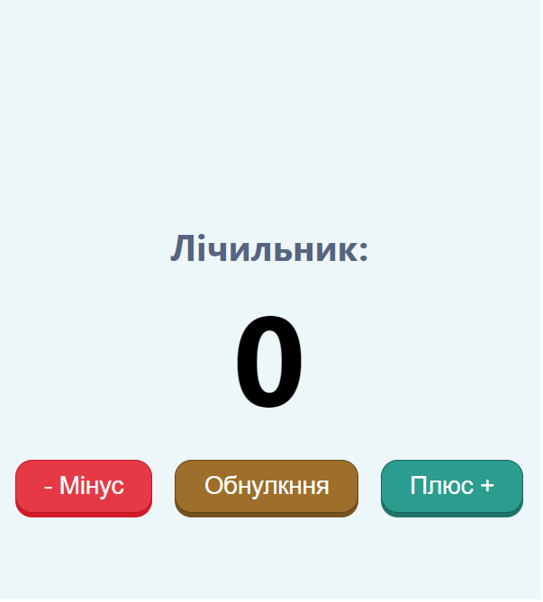
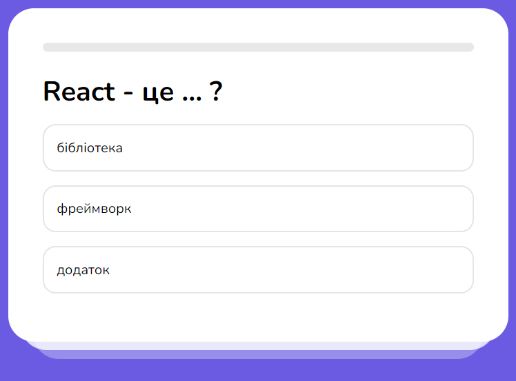
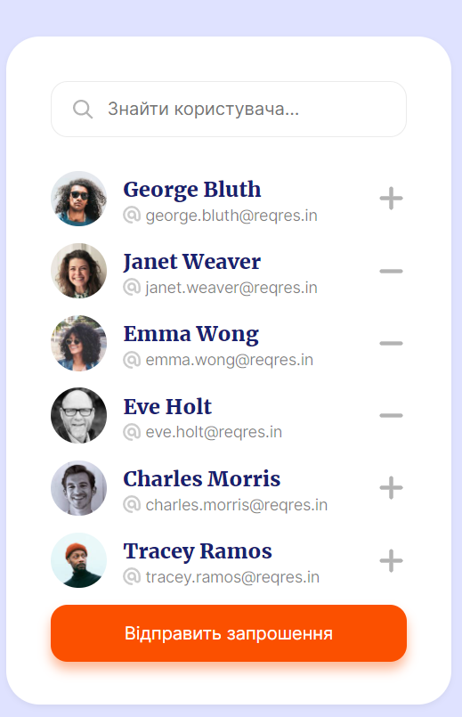
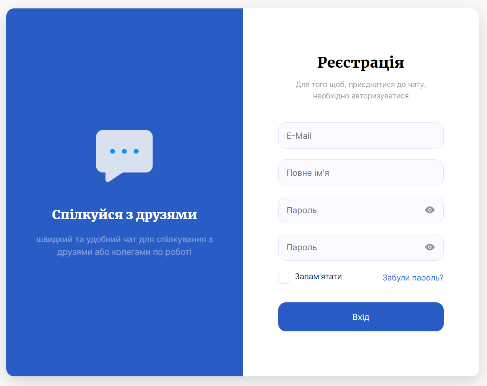

## Лічильник

**🌿 Гілка**: `counter`

**👀 Що вивчив?**

1. Що таке (state)
2. Хук useState
3. Як при клікі на кнопку викликать функцію

## Модальне вікно

**🌿 Гілка**: `modal`

**👀 Що вивчив?**

1. Умовний рендер
2. Як робить анімаційне модальне вікно
3. Як передавать в модальне вікно контент (children)
4. Як передавать пропси

## Quiz (тести)

**🌿 Гілка**: `quiz`

**👀 Що вивчив?**

1. Послідовний рендер контента
2. Progress bar (індекатор виконання)
3. Передача пропсов для рендера результата опитування

## Список гостей (користувачів)

**🌿 Гілка**: `users`

**👀 Що вивчив?**

1. Работа з хуком useEffect
2. Відправка запиту на бекенд за допомогою fetch, рендер отриманих данних
3. Скелетон з допомогою бібліотеки `react-content-loader`
4. Пошук користувачів
5. Рендер списка користувачів
6. Spread-оператор
7. Добавлення/видалення користувачів з масива запрошених
8. Відображення інформації про загруску

## Валідація форм

**🌿 Гілка**: `register-form`

**👀 Що вивчив?**

1. Що таке валідація і як її робить
2. Порівняння полів пароля
3. Робота з бібліотекой `react hook form`
4. Робота з `pattern`
5. Збереження форми в localStoreg при бажанні
